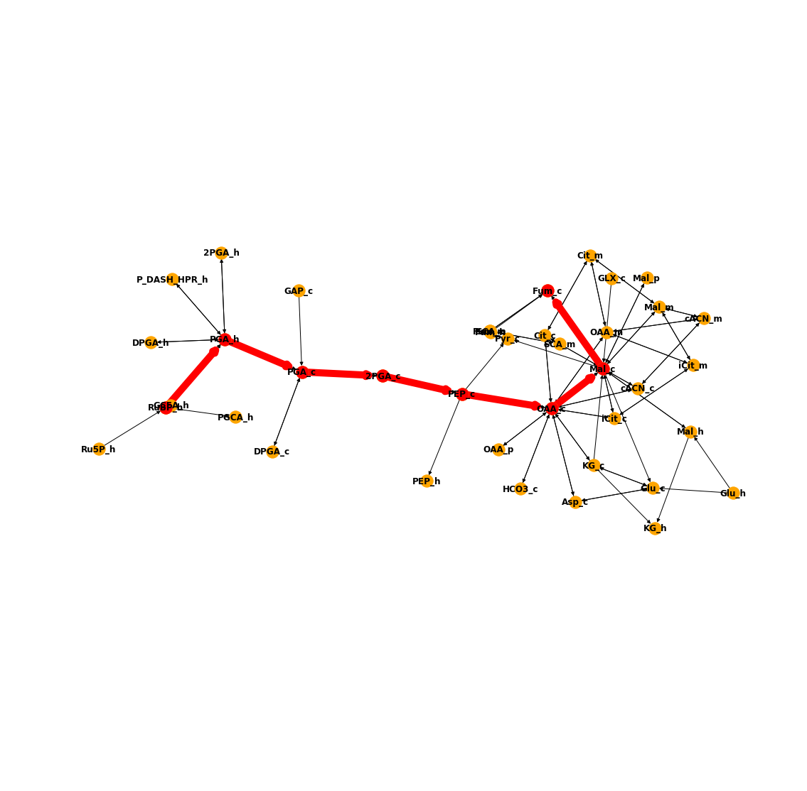
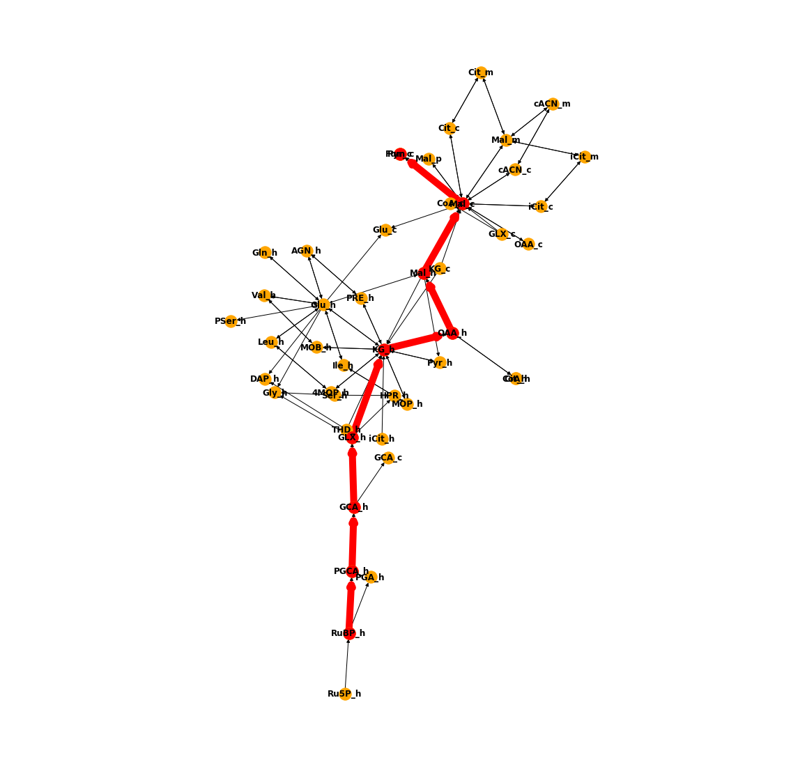
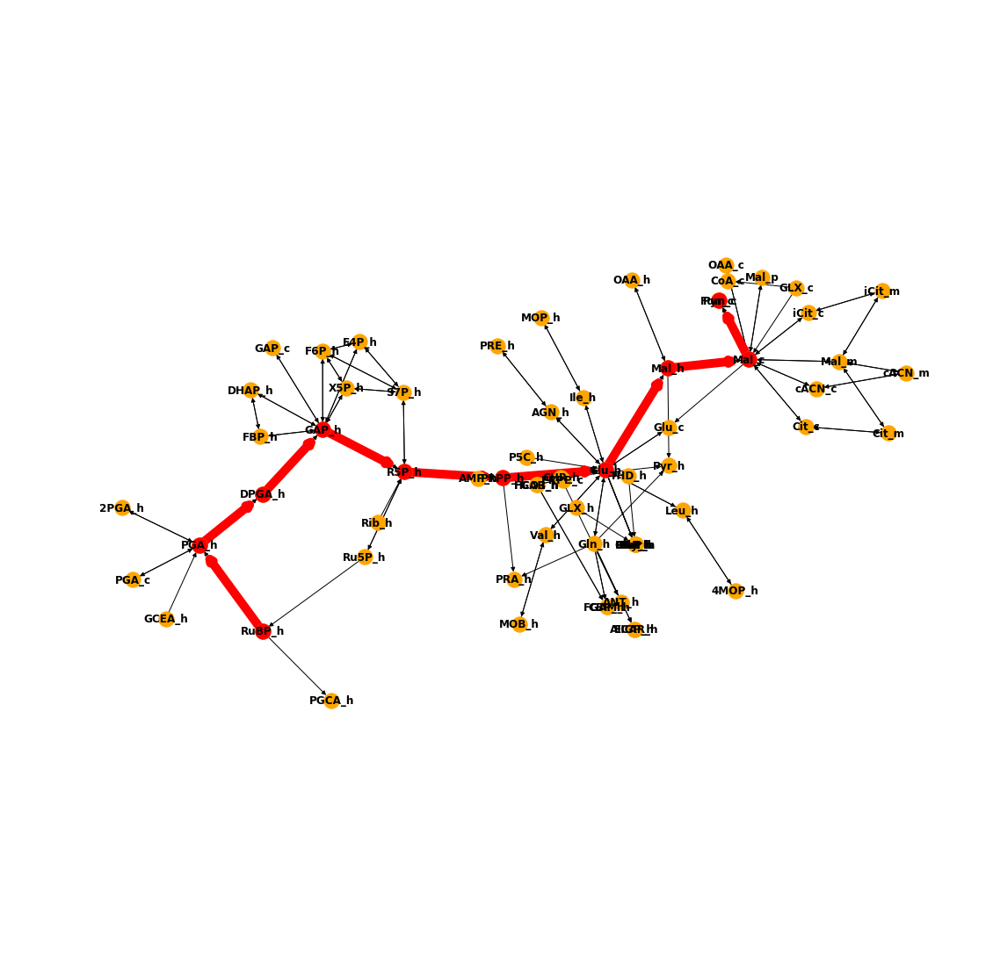

Here we have constructed a metabolite-metabolite network of the carbon backbone of *Arabidopsis* leaf metabolsim for analysing the shortest possible paths to cytosolic fumarate production.

The method was adapted from the min-path method described by [Ranganathan & Maranas, 2010](https://www.ncbi.nlm.nih.gov/pubmed/20665644). 

We used the python package ```NetworkX``` to construct the graph from the [Arnold and Nikoloski 2014 SBML model](https://www.ncbi.nlm.nih.gov/pubmed/24808102) and to conduct the analysis. 

Current shortest pathways to cytosolic fumarate (which breaks upon removing the link from cytosolic malate to fumarate) include: 



When setting OAA -> Pyruvate to be non-reversible... 


